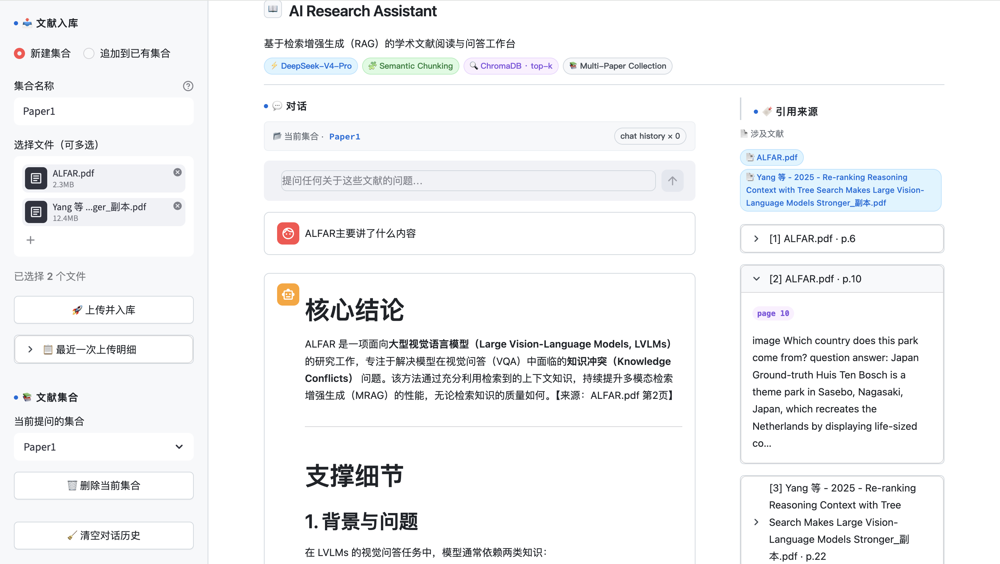

# 🔬 AI Research Assistant

> 基于 RAG（检索增强生成）的学术论文智能问答系统  
> 技术栈：FastAPI + Streamlit + ChromaDB + DeepSeek-V4-Pro API

---

## 目录

- [项目概览](#项目概览)
- [目录结构](#目录结构)
- [快速开始](#快速开始)
- [核心模块说明](#核心模块说明)
- [API 接口文档](#api-接口文档)
- [7 天开发计划](#7-天开发计划)
- [扩展方向](#扩展方向)
- [常见问题](#常见问题)

---

## 项目概览

上传论文或文档 → 系统自动解析切块并向量化入库 → 用自然语言提问 → DeepSeek-V4-Pro 基于文档内容回答，并标注引用页码。



**核心能力**

- 支持 PDF / TXT / Markdown / Word (.docx) 文档上传
- 自动切块 + ChromaDB 本地持久化向量存储
- 基于语义检索的 RAG 问答，答案附带原文引用
- 多轮对话，保留上下文历史
- FastAPI 后端 + Streamlit 前端，本地一键启动

---

## 目录结构

```
ai-research-assistant/
├── backend/
│   ├── __init__.py
│   └── main.py              # FastAPI 入口，所有 API 路由
├── core/
│   ├── __init__.py
│   ├── config.py            # 全局配置（读取 .env）
│   ├── document_processor.py# 文档解析 + 切块
│   ├── vector_store.py      # ChromaDB 向量库封装
│   └── rag_chain.py         # RAG 检索 + DeepSeek 问答链路
├── frontend/
│   ├── __init__.py
│   └── app.py               # Streamlit UI
├── utils/
│   ├── __init__.py
│   └── logger.py            # 日志配置
├── tests/
│   ├── __init__.py
│   └── test_document_processor.py
├── data/
│   ├── uploads/             # 上传的原始文件
│   └── vectorstore/         # ChromaDB 持久化数据
├── logs/                    # 运行日志（自动创建）
├── .env.example             # 环境变量模板
├── requirements.txt
└── run.sh                   # 一键启动脚本
```

---

## 快速开始

### 1. 环境准备

```bash
# 推荐 Python 3.10+
conda create -n research-assistant python=3.10 -y
conda activate research-assistant

# 进入项目目录
cd "AI Research Assistant"

# 安装依赖
pip install -r requirements.txt
```

### 2. 配置 API Key

```bash
cp .env.example .env
```

编辑 `.env` 文件，填入你的 DeepSeek API Key：

```
DEEPSEEK_API_KEY=sk-xxxxxxxxxxxxxxxxxxxxxxxxxxxxxxxx
DEEPSEEK_BASE_URL=https://api.deepseek.com/v1
LLM_MODEL=deepseek-v4-pro
```

其余参数保持默认即可，按需调整：

| 参数 | 默认值 | 说明 |
|------|--------|------|
| `LLM_MODEL` | `deepseek-v4-pro` | 旗舰推理模型；可选 `deepseek-v4-flash` 以追求速度 |
| `CHUNK_SIZE` | `800` | 每个知识块的字符数，论文建议 600–1000 |
| `CHUNK_OVERLAP` | `100` | 相邻块的重叠字符数，避免截断关键句 |
| `RETRIEVER_TOP_K` | `5` | 每次检索返回的最相关块数 |
| `LLM_TEMPERATURE` | `0.2` | 学术问答场景建议低温度，避免发散 |
| `EMBEDDING_MODEL` | `all-MiniLM-L6-v2` | 默认本地 sentence-transformers 模型，零成本 |

### 3. 启动服务

```bash
bash run.sh
```

服务启动后访问：

| 服务 | 地址 |
|------|------|
| 前端界面 | http://localhost:8501 |
| 后端 API | http://localhost:8000 |
| API 交互文档 | http://localhost:8000/docs |

### 4. 单独启动（调试用）

```bash
# 只启动后端
uvicorn backend.main:app --reload --port 8000

# 只启动前端
streamlit run frontend/app.py
```

---

## 核心模块说明

### `core/config.py` — 配置中心

所有模块从这里读取参数，避免硬编码。基于 `pydantic-settings`，自动从 `.env` 加载。

```python
from core.config import settings
print(settings.llm_model)  # deepseek-v4-pro
```

---

### `core/document_processor.py` — 文档解析

**支持格式与解析器对应关系：**

| 格式 | 解析器 | 特点 |
|------|--------|------|
| `.pdf` | PyMuPDF (`fitz`) | 逐页解析，保留页码元数据 |
| `.txt` | 原生读取 | 直接读取全文 |
| `.md` | 原生读取 | 同 TXT |
| `.docx` | python-docx | 段落级提取 |

**切块策略：** `RecursiveCharacterTextSplitter`，按 `\n\n → \n → 。 → . → 空格` 优先级切割，中文场景友好。

每个 chunk 携带元数据：

```python
{
    "source": "paper.pdf",    # 文件名
    "page": 3,                # 原始页码
    "chunk_index": 12,        # 全文第几个 chunk
}
```

---

### `core/vector_store.py` — 向量数据库

封装 ChromaDB 本地持久化操作。每个上传文档对应一个独立集合（collection），集合名 = 文件名（去掉后缀）。

默认嵌入函数使用 `sentence-transformers/all-MiniLM-L6-v2`，**本地运行、零成本**，避免占用 DeepSeek API 配额。

**关键函数：**

```python
# 文档入库
add_documents(docs, collection_name="my_paper")

# 加载已有集合
vectordb = load_collection("my_paper")

# 语义检索（返回 top-k 相关 chunks）
results = similarity_search(vectordb, "transformer 的注意力机制是什么？")

# 查看所有集合
list_collections()

# 删除集合
delete_collection("my_paper")
```

---

### `core/rag_chain.py` — 问答链路

RAG 核心流程：

```
用户问题
   ↓
语义检索（ChromaDB top-k）
   ↓
格式化上下文（含来源标注）
   ↓
构建 Prompt（系统提示 + 历史对话 + 当前问题）
   ↓
调用 DeepSeek-V4-Pro API（OpenAI 兼容协议）
   ↓
返回答案 + 引用来源列表
```

**Prompt 设计要点：**
- 强制要求模型只基于文档内容回答
- 要求在答案中标注 `【来源：文件名 第X页】`
- 文档中无答案时明确说明，避免幻觉

**同步 vs 流式：**

```python
# 同步，返回完整答案 + sources
result = ask(question, vectordb)
print(result["answer"])
print(result["sources"])

# 流式，逐 token 输出（适合 Streamlit streaming）
for token in ask_stream(question, vectordb):
    print(token, end="", flush=True)
```

> DeepSeek 官方 API 与 OpenAI SDK 兼容，本项目通过 `openai` Python SDK 调用，只需配置 `DEEPSEEK_BASE_URL` 即可。

---

### `backend/main.py` — FastAPI 后端

提供 RESTful 接口，Streamlit 前端通过 httpx 调用。

---

### `frontend/app.py` — Streamlit 界面

三栏布局：

- **左侧边栏**：文档上传 + 集合选择 + 对话清空
- **中间主区域**：聊天历史 + 输入框
- **右侧面板**：引用来源（展示最近一次回答的原文片段 + 页码）

---

## API 接口文档

### `POST /upload` — 上传文档

```bash
curl -X POST http://localhost:8000/upload \
  -F "file=@paper.pdf"
```

响应：

```json
{
  "filename": "paper.pdf",
  "collection_name": "paper",
  "chunks_count": 87,
  "message": "✅ 文档处理完成，共生成 87 个知识块"
}
```

---

### `POST /ask` — 问答

```bash
curl -X POST http://localhost:8000/ask \
  -H "Content-Type: application/json" \
  -d '{
    "question": "这篇论文的核心贡献是什么？",
    "collection_name": "paper",
    "chat_history": []
  }'
```

响应：

```json
{
  "answer": "该论文的核心贡献有三点：...\n【来源：paper.pdf 第2页】",
  "sources": [
    {
      "source": "paper.pdf",
      "page": 2,
      "chunk_index": 5,
      "preview": "We propose a novel..."
    }
  ],
  "collection_name": "paper"
}
```

---

### `GET /collections` — 列出所有文档集合

```bash
curl http://localhost:8000/collections
# {"collections": ["paper", "survey_2024"]}
```

---

### `DELETE /collection/{name}` — 删除集合

```bash
curl -X DELETE http://localhost:8000/collection/paper
# {"message": "集合 [paper] 已删除"}
```

---

## 7 天开发计划

| 时间 | 任务 | 验收标准 |
|------|------|----------|
| Day 1 | 搭环境、配置 `.env`、安装依赖 | `python -c "import chromadb; import openai"` 无报错 |
| Day 2 | 完成文档解析模块，跑通切块逻辑 | `pytest tests/` 全部通过 |
| Day 3 | 接通 ChromaDB，完成向量化入库 + 检索 | 可以对测试文档做语义检索，返回相关 chunk |
| Day 4 | 完成 RAG 链路，接通 DeepSeek-V4-Pro API | 终端内可以完成一次完整的问答 |
| Day 5 | FastAPI 接口开发，Postman/curl 验证 | `/upload` 和 `/ask` 接口正常响应 |
| Day 6 | Streamlit 界面，联调前后端 | 浏览器内可以完整演示上传 → 问答 → 查看引用 |
| Day 7 | 测试、准备演示材料、录屏 | 准备 2-3 篇测试论文，能稳定演示 10 分钟 |

---

## 扩展方向

以下功能在 MVP 跑通后可按需添加：

**功能增强**
- 多文档同时问答（合并多个集合的检索结果）
- 一键生成论文结构化摘要（研究问题 / 方法 / 结论）
- 关键词提取与高亮
- 导出对话记录为 PDF / Markdown

**工程优化**
- 流式输出（Streamlit `st.write_stream` + `ask_stream`）
- 文档重复上传检测（MD5 去重）
- 向量检索 + BM25 混合排序（提升精确度）
- 切换至 DeepSeek 官方 Embedding 接口（统一供应商）

**部署**
- Docker Compose 容器化打包
- Nginx 反向代理
- 简单的用户认证（Basic Auth）

---

## 常见问题

**Q: 上传 PDF 后回答答非所问？**  
调小 `CHUNK_SIZE`（试试 500）或调大 `RETRIEVER_TOP_K`（试试 8），让检索覆盖更多原文。

**Q: API Key 如何填写？**  
在 [DeepSeek 开放平台](https://platform.deepseek.com) 创建 Key，复制到 `.env` 中的 `DEEPSEEK_API_KEY=` 后面，不要加引号。若你使用第三方代理网关，把 `DEEPSEEK_BASE_URL` 改为对应地址即可。

**Q: ChromaDB 数据存在哪里？**  
默认在 `data/vectorstore/` 目录，项目重启后数据仍在。删除该目录可清空所有向量数据。

**Q: 想换回 OpenAI / Claude / 其他模型？**  
本项目通过 OpenAI 兼容协议调用 DeepSeek。要替换模型，只需：
1. 在 `.env` 中修改 `DEEPSEEK_API_KEY`、`DEEPSEEK_BASE_URL`、`LLM_MODEL` 三个变量；
2. 若对方 SDK 不兼容 OpenAI 协议，再调整 `core/rag_chain.py` 中的 `OpenAI(...)` 客户端构造。

**Q: 想用 DeepSeek 官方的 Embedding？**  
修改 `core/vector_store.py` 中的 `_get_embedding_function()`，将 `SentenceTransformerEmbeddingFunction` 替换为自定义的 OpenAI 兼容 Embedding 函数，并在 `.env` 中复用 `DEEPSEEK_API_KEY`。

**Q: 中文论文效果差？**  
在 `document_processor.py` 的 `splitter` 中，`separators` 已包含中文句号 `"。"`，应该支持较好。如果效果仍差，可以试试 `CHUNK_SIZE=500`，或将 `EMBEDDING_MODEL` 换成中文表现更好的 `BAAI/bge-small-zh-v1.5`。

---

*Built with ❤️ using FastAPI + Streamlit + ChromaDB + DeepSeek-V4-Pro*
